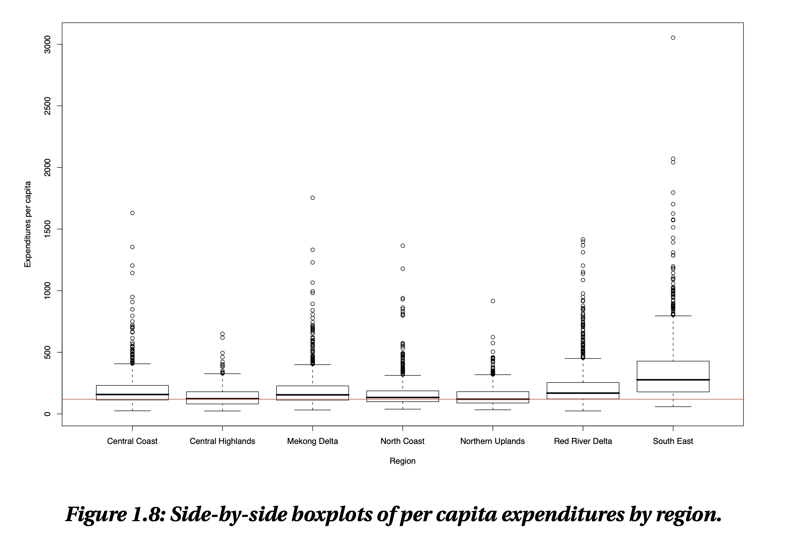
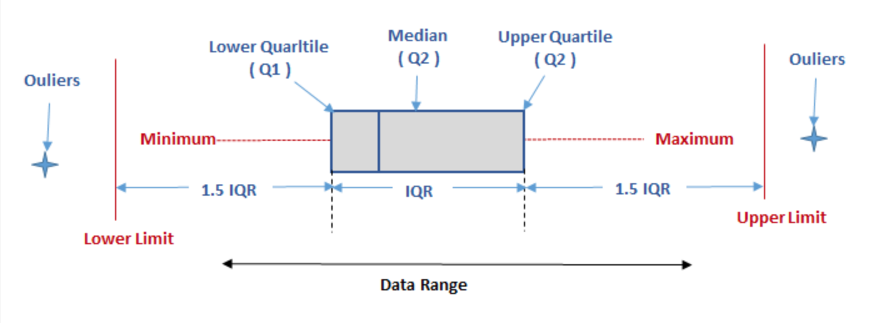

# Box Plot Project

This repository contains a jupyter notebook which investigates the Box Plot.

To run this notebook you must have jupyter installed on your machine. You can install this with the anaconda distribution. The project is available here [Box Plot Project ](https://nbviewer.jupyter.org/github/RitRa/Anscombe-s_quartet-dataset/blob/master/Box%20Plot%20Project.ipynb)

You can also view the file in nbviewer. Unfortunately, sometimes large jupyter files won't load in github https://nbviewer.jupyter.org/

Libraries used in this notebook include:

- **Pandas**: Pandas is an open source, BSD-licensed library providing high-performance, easy-to-use data structures and data analysis tools for the Python programming language. pandas

- **NumPy**: NumPy is the fundamental package for scientific computing with Python. NumPy

- **Seaborn**: Seaborn is a Python data visualization library based on matplotlib. It provides a high-level interface for drawing attractive and informative statistical graphics.

## A look at box plots: History, uses, terminology and alternatives

1. Summarise the history of the box plot and situations in which it used.
Example of John Tukey Box Plot from 1977

2. Demonstrate the use of the box plot using data of your choosing.
    Dungarvan (Clonea) Rainfall Data https://cli.fusio.net/cli/climate_data/webdata/dly2007.csv
    - date:  1995 to 1997
    - rain: Precipitation Amount (mm)	
    - ind:  Indicator	

3. Explain any relevant terminology such as the terms quartile and percentile.
   
   
4. Compare the box plot to alternatives.

